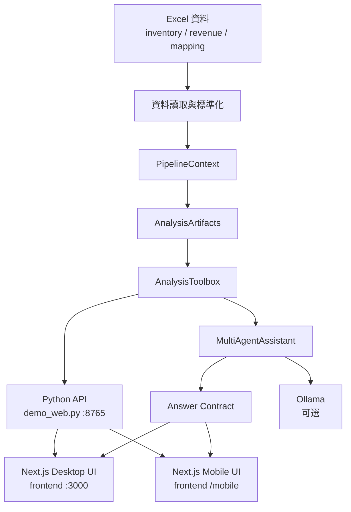
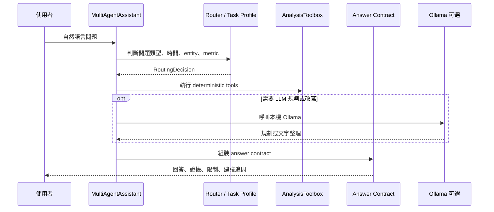

# Revenue POC 白話技術報告

更新日期：2026-06-02

## 1. 一句話摘要

這個專案是一套「用 Excel 當資料來源的營收與庫存智慧分析系統」。它會把庫存表、營收表與對照資料整理成標準格式，再計算月趨勢、事業群與產品線表現、營收/庫存 proxy ratio、異常訊號與圖表資料；最後透過 Python API、Next.js 前端與 multi-agent 問答介面，讓使用者可以用自然語言詢問「哪個事業群營收最高」、「哪個產品線庫存壓力大」、「幫我畫最新月份營收圖」這類問題。

白話來說，它不是單純的 Excel 報表工具，也不是把問題全部丟給 AI 猜答案。它比較像是一個小型資料分析產品原型：

- Excel 負責提供資料。
- Python 負責清理、對齊、計算與產生可信證據。
- Agent 負責判斷使用者想問什麼、該查哪些工具。
- LLM 只在需要時協助規劃或整理文字，不負責憑空算數字。
- 前端負責把 KPI、圖表、表格與回答呈現成可操作的工作台。

## 2. 專案定位

本專案目前的定位是 PoC，也就是 proof of concept。它已經具備接近內部分析產品的骨架，但仍保留一些 PoC 常見特徵，例如啟動流程偏本機、前端有桌機版與手機版兩套、資料刷新需要重啟服務、部分文件與功能仍帶有階段演進痕跡。

它適合處理的問題包含：

- 營收、庫存金額、庫存 QTY 的月度趨勢。
- 最新月份各事業群或產品線的比較。
- 兩個月份之間的營收或庫存差異。
- 事業群或產品線的排行、表格查詢與時間序列。
- 營收相對庫存的 proxy ratio 分析。
- 基於現有資料的風險訊號掃描。
- 產生前端圖表 payload 或 PNG 圖表。
- 以自然語言問答方式查詢上述結果。

它不適合直接處理的問題包含：

- 預測未來營收或需求，因為目前沒有 forecast model。
- 判定真正根因，因為目前資料不足以證明因果。
- 毛利、成本、現金流、EPS、客戶、訂單、出貨等未提供欄位。
- 交易層級 market basket association rules。

## 3. 目前資料現況

以下是使用 `uv run python main.py --project-summary --agent-json` 讀取目前專案資料後得到的現況摘要。

| 項目 | 目前狀態 |
| --- | --- |
| 庫存資料 | `data/inventory.xlsx` |
| 營收資料 | `data/revenue.xlsx` |
| mapping 路徑 | `data/mapping.xlsx` |
| 庫存列數 | 122,935 |
| 營收列數 | 1,982 |
| mapping 列數 | 8 |
| 可用月份 | 2025-01 到 2026-02，共 14 個月 |
| 最新月份 | 2026-02 |
| 支援領域 | sales、inventory、financial、chart |
| association | 目前不可用，因現有資料不足以做完整相關分析 |

最新月份 2026-02 的摘要如下：

| 指標 | 數值 |
| --- | ---: |
| 總營收 | 32,877,963,113 |
| 總庫存金額 | 102,271,212,123.05 |
| 總庫存 QTY | 5,623,769,646 |
| 營收月增率 | -0.73% |
| 庫存金額月增率 | 0.68% |
| 庫存 QTY 月增率 | -5.99% |

目前資料品質警訊：

- 有一個事業群只出現在庫存端：`未對應`。
- 對齊後存在 `revenue_only=23` 與 `inventory_only=45` 的資料列。
- 這代表有些營收資料找不到對應庫存，或有些庫存資料找不到對應營收；系統會保留這些列並在限制說明中揭露，不會偷偷丟掉後假裝資料完美。

## 4. 專案目標

專案目標可以拆成四層。

第一層是資料工程：把使用者提供的 Excel 讀進來，檢查欄位，統一月份格式，清理數值欄位，整理出可分析的標準表。

第二層是分析計算：建立月營收、月庫存、事業群排行、產品線排行、營收/庫存比值、異常訊號、資料品質報告等 artifacts。

第三層是產品化 API：把分析結果包成穩定的 API、chart catalog、chart payload、observation table 與 answer contract，讓前端與 agent 都能重用同一份計算結果。

第四層是自然語言操作：讓使用者可以用白話提問，由 router 判斷問題類型，再由不同 domain agent 使用 deterministic tools 找證據，最後組成有數據、有來源限制、有後續建議的回答。

## 5. 整體架構

整體架構可以想成一條從 Excel 到 UI 的資料流水線。



這個設計最重要的概念是「單一分析真相來源」。也就是說，前端圖表、自然語言回答、資料觀察表與匯出報表，都應該盡量來自同一份 `PipelineContext` 與 `AnalysisArtifacts`。這樣可以避免同一個營收數字在圖表、回答、Excel 匯出中各算各的，最後出現不一致。

## 6. 主要目錄與檔案

| 路徑 | 角色 |
| --- | --- |
| `config.py` | 集中管理資料路徑、輸出路徑、欄位名稱、門檻值與 Ollama 設定 |
| `real_data.py` | 新版真實資料路徑，負責把實際 Excel 欄位標準化成分析用欄位 |
| `data_loader.py` | 舊版資料讀取與欄位檢查 |
| `preprocess.py` | 日期、代碼、文字、數值等清理邏輯 |
| `mapping_parser.py` | 解析 mapping workbook，建立事業群、HQBU、平台與匿名化規則 |
| `analysis_pipeline.py` | 建立 `PipelineContext`，是後端共用分析上下文 |
| `analyzer.py` | 舊版 mapping-based 分析引擎，產生 `AnalysisArtifacts` |
| `analysis_tools.py` | 工具層，封裝所有可查詢、可繪圖、可觀察的 deterministic tools |
| `multi_agent.py` | 問答 orchestrator 與各 domain agent |
| `answer_contract.py` | 統一回答合約，讓前端知道回答、證據、限制與建議如何呈現 |
| `demo_web.py` | Python HTTP API server |
| `main.py` | CLI 入口，可產生報表、進入問答或輸出 project summary |
| `visualizer.py` | 圖表 payload 與 PNG 圖表輸出 |
| `frontend/` | 桌機版 Next.js 分析工作台 |
| `tests/` | 單元測試與合約測試 |
| `eval/` | 問答、planner、smoke regression 結果 |
| `docs/` | 各階段設計文件與 API 說明 |

## 7. 輸入資料設計

系統預設讀取三份檔案：

- `data/inventory.xlsx`
- `data/revenue.xlsx`
- `data/mapping.xlsx`

目前新版主流程會優先走 `real_data.py` 的真實資料解析。這條路徑期待的庫存原始欄位包含：

- `Wn日期`
- `年`
- `月`
- `HQBU`
- `typename`
- `金額`
- `QTY`
- `Productline_5`
- `五大產品線`
- `新事業群`

營收原始欄位包含：

- `公司類別`
- `年度`
- `月份`
- `合併事業群`
- `產品類別名稱`
- `實際營收`
- `五大產品線`
- `新事業群`

這些欄位會被標準化成比較乾淨的內部欄位。例如：

| 原始概念 | 內部欄位 |
| --- | --- |
| 年月 | `month_key` |
| 新事業群 | `business_group` |
| 五大產品線 | `product_line_5` |
| 庫存金額 | `inventory_amount` |
| 庫存數量 | `inventory_qty` |
| 實際營收 | `revenue_amount` |

舊版流程仍保留在 `data_loader.py`、`mapping_parser.py` 與 `analyzer.py`。如果真實資料路徑無法建立有效資料，系統會退回舊版欄位契約與 mapping-based 分析流程。

## 8. 資料處理流程

### 8.1 真實資料優先路徑

目前 `analysis_pipeline.py` 的核心流程是：

1. 先呼叫 `load_real_data_sources()` 讀取庫存與營收 Excel。
2. 如果兩邊都成功讀到資料，就進入 `build_real_analysis_tables()`。
3. 將庫存整理成「月份 + 事業群 + 產品線」粒度。
4. 將營收整理成「月份 + 事業群 + 產品線」粒度。
5. 用這三個 key 做 outer join，產生 `revenue_inventory_aligned`。
6. 針對同時有營收與庫存的列計算 proxy ratio。
7. 產生資料品質報告，例如共同月份、共同事業群、缺失列、只有營收或只有庫存的列。
8. 把新版表格轉成舊版相容的 `AnalysisArtifacts`，讓既有工具與前端不用大改。

白話來說，這條路徑的重點是「先用實際 Excel 欄位建立乾淨的共同分析粒度」。只要營收和庫存能在月份、事業群、產品線三個欄位上對齊，就能比較兩邊的關係。

### 8.2 舊版 mapping-based 路徑

舊版流程會讀取 inventory、revenue、mapping 三份資料，並透過 mapping 建立以下對照：

- 事業群代碼到事業群名稱。
- 庫存 HQBU 代碼到庫存分類。
- 營收平台代碼到營收分類。
- HQBU 到平台的 bridge candidate。
- 匿名化欄位處理規則。

舊版流程比較適合處理代碼化、匿名化後的資料。它會盡量建立 HQBU 與平台的對照，但如果對照不可靠，系統會產生 warning，不會硬把模糊關係當成事實。

## 9. 分析引擎

分析引擎最後會產生一個 `AnalysisArtifacts` 物件。它可以理解成「所有分析成果的資料包」，主要包含：

| Artifact | 說明 |
| --- | --- |
| `inventory_enriched` | 清理並補上分類後的庫存資料 |
| `revenue_enriched` | 清理並補上分類後的營收資料 |
| `monthly_revenue` | 各月份總營收與月增率 |
| `monthly_inventory_amount` | 各月份總庫存金額與月增率 |
| `monthly_inventory_qty` | 各月份總庫存 QTY 與月增率 |
| `revenue_by_group` | 依事業群彙總營收 |
| `inventory_by_group` | 依事業群彙總庫存 |
| `merged_analysis` | 營收與庫存對齊後的分析主表 |
| `platform_monthly_analysis` | 前端與舊工具沿用的每月事業群/平台分析表 |
| `anomalies` | 異常訊號表 |
| `correlation_analysis` | 相關性分析表；目前真實資料路徑下不可用 |
| `summary_metrics` | 匯出 Excel 時使用的彙總表集合 |
| `report_context` | 產生 Markdown 與 LLM 說明需要的摘要資料 |
| `revenue_inventory_aligned` | 新版真實資料對齊主表 |
| `data_quality_report` | 新版資料品質報告 |

### 9.1 主要計算邏輯

系統目前會計算：

- 每月營收總額。
- 每月庫存金額。
- 每月庫存 QTY。
- 各事業群營收與庫存排名。
- 各產品線營收與庫存排名。
- 營收/庫存金額 proxy ratio。
- 營收/庫存 QTY proxy ratio。
- 月增率。
- 最新月份弱勢 proxy 排名。
- revenue-only 與 inventory-only 對齊狀態。

### 9.2 proxy ratio 的意思

專案裡的 `revenue_inventory_amount_ratio` 不是正式財務周轉率。它只是用目前資料能推導出的 proxy：

```text
營收/庫存金額 proxy = revenue_amount / inventory_amount
```

如果這個值偏低，通常代表「營收相對庫存金額較弱」。但它不能直接解釋原因，也不能等同庫存周轉率。原因可能是資料粒度、時間落差、品類特性、會計口徑或資料缺失造成，因此回答裡必須保留限制說明。

## 10. 異常偵測

舊版 `analyzer.py` 內的異常偵測包含幾種規則：

- 營收月增率超過門檻。
- 庫存金額月增率超過門檻。
- 庫存上升但營收沒有同步上升。
- 營收下降但庫存仍高。
- 營收/庫存金額比偏低。
- 營收/庫存 QTY 比偏低。
- 連續多月庫存上升但營收下降。

新版真實資料路徑目前比較保守，主要在最新共同月份中找出營收/庫存金額 proxy 偏弱的前幾名。這樣做的好處是風險較低，避免在資料對齊仍有缺口時做過度診斷。

目前資料中最新月份的異常訊號數量為 5，其中最需要注意的是 `7製造` 的營收/庫存金額 proxy 偏弱訊號。

## 11. Tool Layer：為什麼它重要

`analysis_tools.py` 是這個專案很關鍵的一層。它把底層 DataFrame 包成穩定工具，讓 API、agent、前端都不用直接操作 pandas。

可以把它想成「分析工具箱」。常見工具包含：

- `get_data_coverage()`：查目前資料涵蓋哪些月份、幾筆資料、支援哪些 domain。
- `get_tool_capability_matrix()`：告訴 agent 目前哪些工具可用、支援哪些 filter。
- `get_metric_table()`：取出指定指標表。
- `get_top_groups()`：取得營收或庫存排名。
- `get_platform_ratios()`：取得營收/庫存 proxy ratio。
- `get_anomalies()`：取得異常訊號。
- `get_mapping_summary()`：取得 mapping 摘要。
- `get_chart_catalog()`：列出前端可畫的圖。
- `get_chart_payload()`：產生 Recharts 或圖表元件可用的資料。
- `create_chart_image()`：輸出 PNG 圖。
- `get_observation_options()`：取得觀察區可選月份、事業群、產品線。
- `get_observation_table()`：產生前端資料觀察表。
- `get_entity_metric_value()`：查單一月份、單一 entity 的指定指標。
- `get_entity_time_series()`：查某 entity 的多月時間序列。
- `get_entity_contribution_analysis()`：比較兩期變化來源。

這層最大的價值是控制資料邊界。Agent 不能任意自己拼 SQL 或自己算 Excel；它必須透過工具取數據。這讓回答更可測、更可追蹤，也比較不容易出現 AI 編數字。

## 12. Multi-Agent 問答架構

問答入口在 `MultiAgentAssistant.answer()`。一個問題進來後，大致會經過五個步驟：



目前 domain agent 包含：

| Agent | 負責範圍 |
| --- | --- |
| `SalesAgent` | 營收趨勢、營收排行、營收查詢 |
| `InventoryAgent` | 庫存金額、庫存 QTY、庫存趨勢 |
| `FinancialMetricsAgent` | 營收與庫存的 proxy ratio、效率與風險訊號 |
| `ChartAgent` | 圖表需求、chart payload、圖表表格 |
| `AssociationAgent` | 相關性與關聯分析；目前資料下能力有限 |

### 12.1 問題分類

專案有一套 canonical task taxonomy，記錄在 `docs/task_taxonomy.md`。常見 task family 包含：

- `metric_lookup`：查某月份某指標是多少。
- `entity_ranking`：問哪個事業群或產品線最高/最低。
- `latest_month_entity_summary`：整理最新月份各 entity 表現。
- `cross_section_compare`：同月份橫向比較。
- `period_pair_compare`：兩個月份比較。
- `entity_time_series`：某 entity 的多月走勢。
- `overall_trend_analysis`：整體趨勢。
- `entity_trend_comparison`：多個 entity 的趨勢比較。
- `performance_assessment`：表現強弱、庫存壓力、健康分數。
- `risk_scan`：找風險訊號。
- `metric_relationship_analysis`：營收與庫存關係。
- `contribution_analysis`：成長或下降主要來自哪裡。
- `parent_child_drilldown`：某事業群底下產品線比較。
- `data_quality`：資料涵蓋與品質問題。
- `chart_request`：要求畫圖。
- `forecast_unsupported`：預測類問題，明確拒絕當成可回答預測。

### 12.2 LLM 的角色

系統可以串本機 Ollama，設定在 `config.py`：

- `OLLAMA_BASE_URL` 預設 `http://localhost:11434`
- `OLLAMA_MODEL` 預設 `gemma4:e4b`
- `OLLAMA_TIMEOUT_SECONDS` 預設 90 秒

但 LLM 不是單點依賴。設計原則是：

- 數字由 deterministic tools 產生。
- LLM 不負責自己計算營收、庫存、排名。
- LLM planner 或 rewriter 如果輸出不合規，會 fallback deterministic。
- 預測、根因、未支援欄位不能被 LLM 包裝成肯定答案。

## 13. Answer Contract：回答為什麼可追蹤

`answer_contract.py` 會把 agent 結果整理成穩定 JSON。這個 contract 對產品化很重要，因為前端不能只拿一段純文字；它還需要知道這段文字背後的證據、工具、限制與資料範圍。

主要欄位包含：

| 欄位 | 說明 |
| --- | --- |
| `answer` | 給使用者看的主回答 |
| `evidence` | 支撐回答的結構化證據 |
| `tools_used` | 本次回答用過哪些 deterministic tools |
| `data_scope` | 回答依據的月份、domain、filter 與支援領域 |
| `limitations` | 必須揭露的資料限制與 proxy caveat |
| `suggested_followups` | 建議下一步可以追問什麼 |
| `display_blocks` | 前端可直接渲染的結構化區塊 |
| `task_profile` | canonical 問題解析結果 |
| `answer_plan` | 回答策略與證據計畫 |

這種 evidence-first 的設計可以降低 AI 問答常見的風險：回答聽起來很順，但不知道數字從哪裡來。

## 14. API 設計

Python API 入口在 `demo_web.py`，使用標準函式庫的 `ThreadingHTTPServer`，預設監聽：

```text
http://127.0.0.1:8765
```

### 14.1 GET endpoints

| Endpoint | 用途 |
| --- | --- |
| `GET /` | 回傳服務狀態與 endpoint 清單 |
| `GET /api/health` | API 與 pipeline 健康狀態 |
| `GET /api/data-version` | 目前資料版本、月份、列數與來源檔 |
| `GET /api/pipeline-status` | pipeline infos、warnings、errors |
| `GET /api/data-quality` | 產品化資料品質報告 |
| `GET /api/summary` | 專案摘要、最新月份 snapshot、dashboard snapshot |
| `GET /api/chart-catalog` | 可用圖表清單 |
| `GET /api/observe-options` | 資料觀察區可用選項 |

### 14.2 POST endpoints

| Endpoint | 用途 |
| --- | --- |
| `POST /api/ask` | 自然語言問答 |
| `POST /api/chart` | 產生指定 chart payload 與可選 PNG |
| `POST /api/observe` | 產生 observation table |

### 14.3 狀態判斷

API health 的狀態規則很直覺：

1. 如果有 errors，狀態是 `error`。
2. 如果沒有 errors 但有 warnings，狀態是 `warning`。
3. 如果都沒有，狀態是 `ok`。

這套規則同時用在 `/api/health`、`/api/pipeline-status` 與 `/api/data-quality`。

## 15. 前端架構

專案目前已整併成單一 Next.js 前端，桌機與手機體驗都在 `frontend/`。

### 15.1 桌機版 `frontend/`

桌機版定位是分析師工作台，主要畫面由 `frontend/components/insight-console.jsx` 組成。它提供：

- 最新月份 KPI。
- 對話式分析區。
- 快速提示問題。
- 結構化回答卡片。
- 圖表儀表板。
- 圖表對應表格。
- 資料觀察區。
- 事業群與產品線切換。
- 問答 history 與 chart context 傳回後端。

Next API routes 會透過 `frontend/lib/python-api.js` 轉發到 Python API。預設 Python API base 是 `http://127.0.0.1:8765`，也可用 `PYTHON_API_BASE` 覆蓋。

### 15.2 手機版 `frontend/app/mobile`

手機版已移到 `frontend/app/mobile`，定位偏管理層快覽，介面比較輕量：

- KPI tile。
- 單頁 dashboard。
- mobile chart surface。
- drawer 式 AI 問答。
- 簡化互動。

### 15.3 前端整併狀態

獨立的 `mobile-demo/` 已刪除。現在桌機版與手機版共用同一個 `frontend/` 專案、同一份 API proxy、共用 chart/chat/KPI 模組，手機入口為 `/mobile`。

## 16. 圖表設計

圖表能力集中在 `analysis_tools.py` 的 chart definitions 與 `visualizer.py`。

目前支援的圖表類型包含：

- 整體營收趨勢折線圖。
- 整體庫存金額趨勢折線圖。
- 整體庫存 QTY 趨勢折線圖。
- 最新月份各事業群營收長條圖。
- 最新月份各事業群庫存長條圖。
- 最新月份各產品線營收長條圖。
- 最新月份各產品線庫存長條圖。
- 事業群或產品線圓餅圖。
- health score 排名。
- revenue/inventory proxy ratio 排名。
- 異常訊號排行。

圖表 API 的設計重點是前後端分工清楚：

- 後端決定 chart key、資料表、filter 與 payload。
- 前端負責渲染互動與視覺呈現。
- 若需要 demo 或報告輸出，後端也可以產生 PNG。

## 17. CLI 與輸出報表

`main.py` 是 CLI 入口，常用方式包含：

```bash
uv run python main.py
uv run python main.py --generate-test-data
uv run python main.py --chat
uv run python main.py --project-summary --agent-json
uv run python main.py --agent-question "請整理最新月份各事業群的營收與庫存重點"
```

傳統分析流程會輸出到 `output/`，包含：

- `cleaned_inventory.xlsx`
- `cleaned_revenue.xlsx`
- `parsed_mapping.xlsx`
- `merged_analysis.xlsx`
- `summary_metrics.xlsx`
- `analysis_report.md`
- `llm_explanation.md`
- `qa_transcript.md`
- `charts/*.png`
- `logs/*.log`

注意：目前 API server 走的是 `build_pipeline_context()`，會優先走真實資料路徑；`main.py` 的傳統報表路徑仍保留舊版 mapping-based 流程。因此若要讓 CLI 匯出與 API 完全一致，後續可以再整理這兩條路徑。

## 18. 啟動方式

### 18.1 Python 後端

```bash
uv run python demo_web.py
```

預設啟動：

```text
http://127.0.0.1:8765
```

### 18.2 桌機前端

```bash
cd frontend
npm run dev
```

預設 Next.js dev server 通常是：

```text
http://127.0.0.1:3000
```

### 18.3 手機前端

```bash
cd frontend
npm run dev
```

手機版不再使用獨立 dev server；啟動 `frontend/` 後開啟 `http://127.0.0.1:3000/mobile`。

### 18.4 Windows script

`scripts/` 下保留 PowerShell 與 batch 啟動腳本，例如：

- `scripts/start_backend.ps1`
- `scripts/start_frontend.ps1`
- `scripts/start_mobile.ps1`
- `scripts/start_all.ps1`
- `scripts/START_ALL.bat`

這些腳本適合 demo 場景，但若要部署成正式服務，建議改用明確的 process manager、container 或 service unit。

## 19. 測試與評估

專案測試集中在 `tests/`，目前涵蓋面相包含：

- 資料載入與真實資料合約。
- 分析工具與圖表 payload。
- answer contract。
- evidence contract。
- task profile 與 canonical task。
- router。
- LLM planner 與 rewriter。
- writer validator。
- API status endpoints。
- 前端圖表與 demo readiness。

`eval/` 目錄則保存多組 regression 與 smoke 結果，例如：

- `demo_smoke_report.md`
- `eval_report.md`
- `llm_planner_eval_report.md`
- `demo_answer_review.md`
- `demo_llm_writer_shadow_report.md`

這些測試與 eval 的價值在於保護問答品質。自然語言系統很容易因為一點 routing 改動就造成回答飄移，因此用 contract test 與 regression case 鎖住行為是合理的。

## 20. Logging 與可觀測性

日誌工具在 `logging_utils.py`。每次 request 會帶 `request_id`，並且 domain agent、toolbox、pipeline 都會記錄關鍵事件。

主要用途：

- 追蹤一次問答用了哪些 tools。
- 檢查 LLM planner 是否被啟用。
- 檢查 fallback 是否發生。
- 查看 pipeline warnings / errors。
- debug 前端顯示與後端資料是否一致。

常見 log 位置：

```text
output/logs/
```

## 21. 安全與資料治理觀點

這個專案處理的是營收與庫存資料，即使已去識別化，仍應該用內部敏感資料的標準看待。

目前設計上的正向點：

- 不把所有計算交給外部雲端 LLM。
- Ollama 預設是本機端點。
- 回答保留 evidence 與 limitations。
- 不支援預測與根因時會明確拒絕。
- 資料來源路徑與 data version 可查。

仍需注意的點：

- Excel 檔本身仍在 repo 工作目錄內，正式環境應避免把敏感資料 commit。
- `output/` 可能包含分析結果、圖表與 log，也可能具敏感性。
- 若未來改接雲端 LLM，必須新增資料遮罩、欄位白名單與 prompt 外送審查。
- 若要多人使用，需要權限控管與 audit trail。

## 22. 技術債與風險

### 22.1 前端重複

此項已處理：獨立的 `mobile-demo/` 已刪除，手機體驗已移入 `frontend/app/mobile`。後續仍需維持共用元件邊界，避免桌機與手機邏輯重新分叉。

### 22.2 CLI 與 API 主流程不完全一致

API 走 `build_pipeline_context()`，會優先使用真實資料路徑；傳統 `main.py` 報表流程仍直接使用 `data_loader.py`、`mapping_parser.py`、`analyzer.py`。兩者共用很多概念，但不是完全同一條 pipeline。

### 22.3 啟動時建立完整 context

`demo_web.py` 啟動時就建立完整 `PipelineContext`。這對 demo 很方便，但有幾個限制：

- 啟動時間會隨資料量變大。
- Excel 更新後需要重啟 API 才能刷新。
- 多使用者或大資料量場景下需要 cache / reload 策略。

### 22.4 欄位契約耦合

系統很依賴 Excel 欄位名稱與特定格式。一旦來源欄位改名或新增合併儲存格、表頭列偏移，讀取流程就可能失敗。

### 22.5 proxy 指標容易被誤解

營收/庫存比值是有用的觀察訊號，但不是正式財務指標。產品介面與回答文字必須持續提醒它是 proxy，不是因果或正式周轉率。

### 22.6 association 能力目前有限

目前資料摘要顯示 `association=false`，`correlations` metric 不可用。若未來要做更完整關聯分析，需要先確認資料粒度、共同 key 與樣本數是否足夠。

## 23. 建議演進路線

### 第一階段：穩定現有 demo

- 清理舊文件中的過期路徑與階段名稱。
- 確認 README、TECHNICAL_REPORT、docs 與實際程式一致。
- 建立固定的 demo smoke script，一次檢查 API、summary、ask、chart、observe。
- 把 `output/` 與敏感 Excel 的 git 策略整理清楚。

### 第二階段：合併 pipeline

- 讓 CLI 報表輸出也改用 `build_pipeline_context()`。
- 避免 API 與 CLI 各自走不同資料處理路徑。
- 將 `AnalysisArtifacts` 的新版/舊版欄位語意整理成明確文件。

### 第三階段：合併前端

- 持續維護單一 `frontend/` Next.js 專案。
- 共用 API routes、chart surface、message card、KPI components。
- 用 responsive layout 或 `/mobile` route 保留手機體驗。

### 第四階段：資料刷新與版本控管

- 新增 `/api/reload-data` 或後台 reload 流程。
- data version 加入檔案 mtime、hash 或 dataset id。
- 對 chart payload 與 summary 做 cache。
- 在 UI 顯示目前資料版本與最新刷新時間。

### 第五階段：正式化部署

- 將 Python API 改為 FastAPI 或其他正式 web framework。
- 建立 container 化部署。
- 增加 authentication。
- 設計資料目錄與輸出目錄的權限控管。
- 導入 structured logging 與 monitoring。

